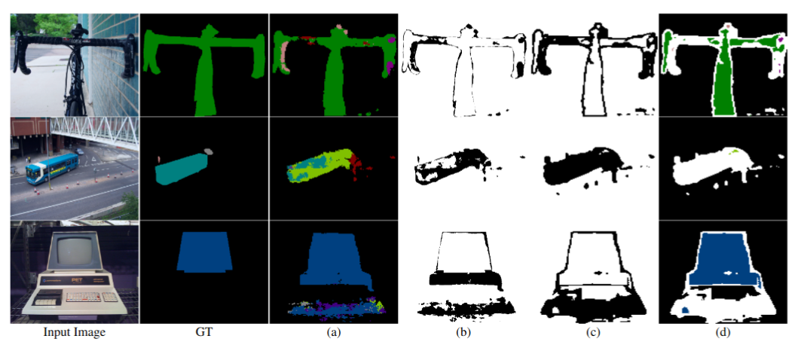

# Semi-supervised Semantic Segmentation with Error Localization Network
[Our paper](https://arxiv.org/pdf/2204.02078.pdf), [Project page](http://cvlab.postech.ac.kr/research/ELN/)

*Donghyeon Kwon and Suha Kwak*

> kinux98@postech.ac.kr

This repository contains the official implementation of : 
> Semi-supervised Semantic Segmentation with Error Localization Network

that has been accepted to 2022 IEEE/CVF Conference on Computer Vision and Pattern Recognition (CVPR 2022).

<div align="center">
  
</div>

## Highlight
- Segmentation networks trained by our method achieves the state of the art on two benchmark datasets, PASCAL VOC 2012 and Cityscapes, in every setting.
  
- We propose error localization, a new approach to dealing with errors on pseudo labels. It is simple yet effective and can be naturally incorporated with self-training and contrastive learning. 
  
- We develop a new strategy for generating diverse and plausible prediction errors intentionally during the training of ELN. This improves the generalization of ELN even using a small number of labeled data for training.


## Requirements
The repository is tested on Ubuntu 20.04.1 LTS, Python 3.8.8, PyTorch 1.11.0 and CUDA 11.4. We use a NVIDIA GeForce RTX3090 for the training.

After preparing virtual environment, download requirementes packages with :

> pip install requirements.txt

### wandb settings

Before starting, you should login wandb using your personal API key.

>wandb login PERSONAL_API_KEY


## Dataset

### 1. Set the base directories in "SSL_ELN/dataset/common.py"
> base_voc = "./dataset/pascal_voc_seg/VOCdevkit/VOC2012"
>
> base_city = "./dataset/cityscapes/"

### 2. Download and process dataset
For PASCAL VOC 2012, we also use additional SBD augmentation dataset. 

If you don't have SBD dataset, please refer to [this blog](https://www.sun11.me/blog/2018/how-to-use-10582-trainaug-images-on-DeeplabV3-code/).

For Cityscpaes, you can download the dataset from their official [website](https://www.cityscapes-dataset.com).

Afterwards, your data directory structure should have following scheme:

    ├── ./dataset/pascal_voc_seg/VOCdevkit/VOC2012                    
                                            ├── Annotations 
                                            ├── ImageSets
                                            │   ├── Segmentation
                                            │   │   ├── 1_labeled_0.txt
                                            │   │   ├── 1_labeled_1.txt
                                            │   │   └── ... 
                                            │   └── ... 
                                            ├── JPEGImages
                                            ├── SegmentationClass
                                            ├── SegmentationClassAug
                                            └── ...
    
    ├── ./dataset/cityscapes                     
                    ├── data_lists
                    │   ├── 1_labeled_0.txt
                    │   ├── 1_labeled_1.txt
                    │   └── ...  
                    ├── gtFine
                    └── leftImage8bit

## Training
### PASCAL VOC 2012

> Using ResNet101 Backbone
> 
> python3 train.py --exp-name=voc_20_res101 --train-split=4 --dataset=voc --pre_epoch=70 --eln_epoch=50 --backbone_name=101 --batch-size-labeled=6 --batch-size-unlabeled=6


> Using ResNet50 Backbone
> 
> python3 train.py --exp-name=voc_20_res50 --train-split=4 --dataset=voc --pre_epoch=70 --eln_epoch=50 --backbone_name=50 --batch-size-labeled=6 --batch-size-unlabeled=6

### Cityscapes

> Using ResNet50 Backbone
> 
> python3 train.py --exp-name=city_2_res50 --train-split=2 --dataset=city --pre_epoch=100 --eln_epoch=58 --backbone_name=50 --batch-size-labeled=4 --batch-size-unlabeled=4

---
You may change labeled-unlabeled data ratio by modifying "--train-split=".

For VOC, you can choose split value from (20, 8, 4).

For Cityscapes, you can choose split value from (8, 4, 2).

## Visualization
you can visualize segmentation ground truth/model's result, ELN's binary mask, and its filtered results with visualize.py:

> python3 visualize.py --dataset='voc' --pretrained-ckpt=./path/to/saved/model.pth --backbone_name=101 --image-path=./path/to/input/image --gt-path=./path/to/gt

Of course, you may change arguments to proper value.

## Citation
If you find this project useful, please consider citing as follows:
```
@InProceedings{Kwon_2022_CVPR,
    author    = {Kwon, Donghyeon and Kwak, Suha},
    title     = {Semi-Supervised Semantic Segmentation With Error Localization Network},
    booktitle = {Proceedings of the IEEE/CVF Conference on Computer Vision and Pattern Recognition (CVPR)},
    month     = {June},
    year      = {2022},
    pages     = {9957-9967}
}
```


### Acknowledgements

We borrow some codes from 

 - https://github.com/voldemortX/DST-CBC/

- https://github.com/jfzhang95/pytorch-deeplab-xception.

  
